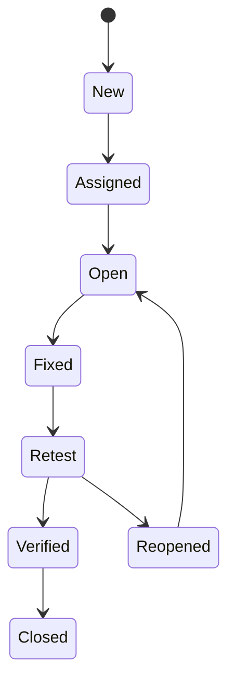

# Defect Management

## What is a defect

A defect is any deviation between expected and actual behavior that impacts
functionality, performance, security, or user experience.

## Defect reporting principles

- Reproducible: clear steps and data
- Specific: include environment, build, and version
- Actionable: expected vs actual results
- Evidence-based: logs, screenshots, or videos
- Risk-aware: severity and impact clearly stated

## Defect states and transitions

Common states:

- New, Assigned, Open, Fixed, Retest, Verified, Closed, Reopened

Key transitions:

- New to Assigned when triaged
- Fixed to Retest after a code change
- Retest to Verified when resolved
- Retest to Reopened if issue persists

