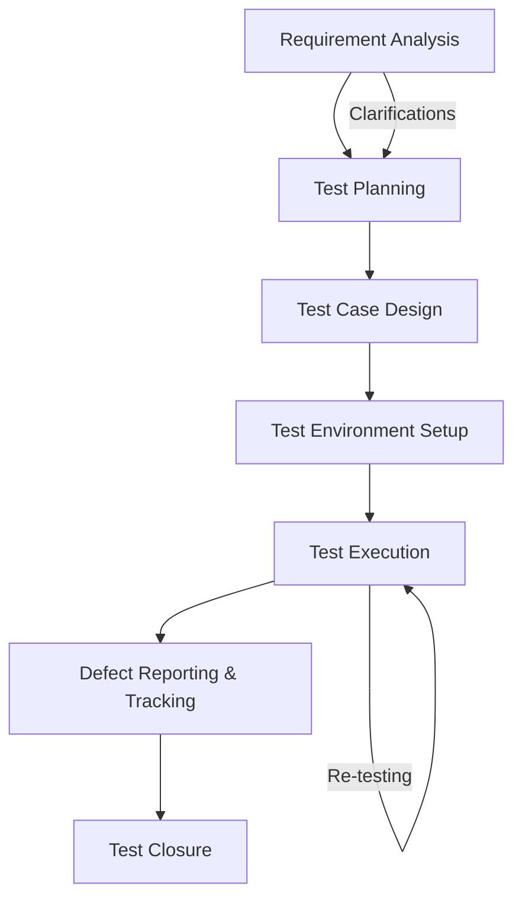

# Software Testing Life Cycle (STLC)

STLC is the structured sequence of activities that ensures testing is planned,
executed, and closed in a controlled and measurable way.

## STLC phases

1. Requirement Analysis
   - Review requirements, risks, and acceptance criteria
   - Identify testable elements and gaps
2. Test Planning
   - Define scope, approach, resources, and schedule
   - Establish entry/exit criteria and reporting
3. Test Case Design
   - Create test scenarios, cases, and data
   - Map to requirements for coverage
4. Test Environment Setup
   - Prepare environments, tools, and data
   - Validate readiness
5. Test Execution
   - Run tests and record results
   - Re-test fixes and run regression as needed
6. Defect Reporting and Tracking
   - Log defects with evidence and severity
   - Track through resolution and verification
7. Test Closure
   - Summarize results, metrics, and lessons learned
   - Archive artifacts and improve processes

## STLC flow

